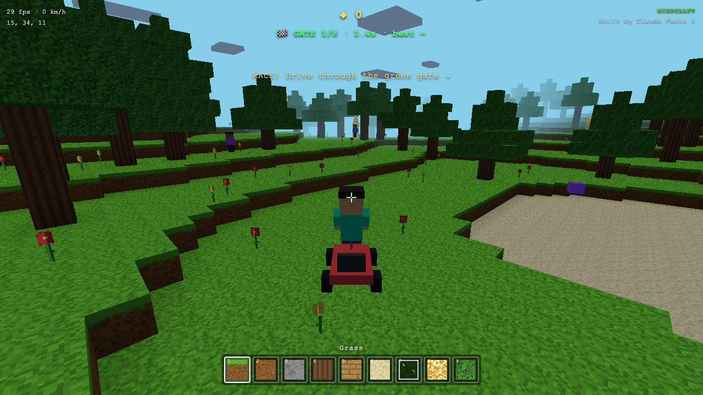

# ⛏ MINDCRAFT

**A Minecraft-style voxel world that runs entirely in your browser — built live by [Claude Fable 5](https://claude.com), Anthropic's frontier AI model.**

No game engine. No assets. No build step. Every texture, sound, character, and world is generated by ~2,500 lines of code.



## ▶ Play

**[Play it in your browser →](https://emmanuel-inc.github.io/mindcraft/)**

Or run it locally — it's pure static files:

```bash
npx serve .
# open http://localhost:3000
```

Add `?seed=42` (any number) to the URL for a different world. Same seed = same world, every time.

## What's inside

- **Infinite procedural terrain** — hills, oceans, beaches, snow-capped mountains, underground cave systems, forests, flowers
- **Build & break** — 9 block types, particles, block highlighting, synthesized sound effects (WebAudio, no audio files)
- **Characters** — third-person player with walk animations, plus villager NPCs that wander, hop ledges, avoid cliffs, and wave hello
- **🏎 Kart mode** — summon a go-kart and drive: terrain-following physics, drift dust, wall bounces, catching air off cliffs
- **🔥 Fireballs & enemies** — blast hopping glitch-slimes (or run them over for bonus points)
- **🏁 Race mode** — a loop of golden gates, a timer, and your best time saved locally
- **Day/night cycle** — moving sun and moon, stars, sunset color grading, drifting clouds, dynamic fog
- **◆ Collectibles** — golden shards scattered across the world, infinite treasure hunt

## Controls

| Key | Action |
|---|---|
| `WASD` + mouse | move + look |
| Left / right click | break / place block |
| `1–9` / scroll | choose block |
| `Space` | jump / swim / fly up |
| `Shift` | sprint |
| `V` | first / third person |
| `G` | get in / out of the kart |
| `X` (or click in kart) | shoot fireball |
| `R` | start the gate race |
| `F` | fly mode (`C` to descend) |
| `H` | hide HUD |

## Tech notes

- **Three.js** (via CDN import map) is the only dependency
- Chunked voxel engine (16×96×16) with face-culled meshing and **per-vertex ambient occlusion**
- Deterministic seeded value-noise terrain — caves are carved by intersecting 3D ridged noise
- Texture atlas painted procedurally onto a canvas at boot — zero image files
- All sounds synthesized with the WebAudio API — zero audio files
- DDA voxel raycasting for block targeting

## The story

This game was built end-to-end by Claude Fable 5 inside [Claude Code](https://claude.com/claude-code) — world engine, physics, AI characters, kart handling, the lot — as part of a video project by [Emmanuel Nyatefe](https://emmanuelnyatefe.com). The AI also wrote its own headless browser tests and took its own screenshots to verify the game worked.

## License

MIT © Emmanuel Nyatefe
